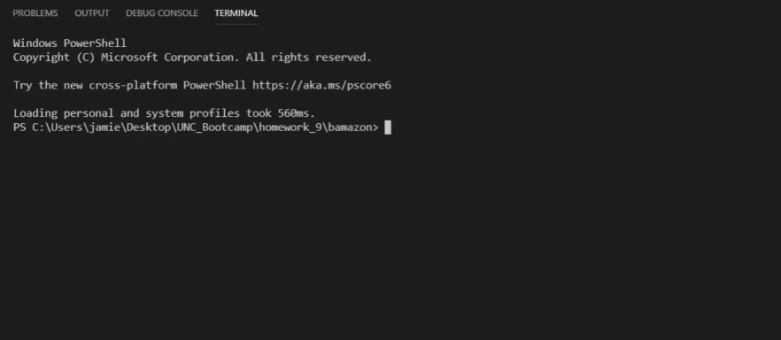
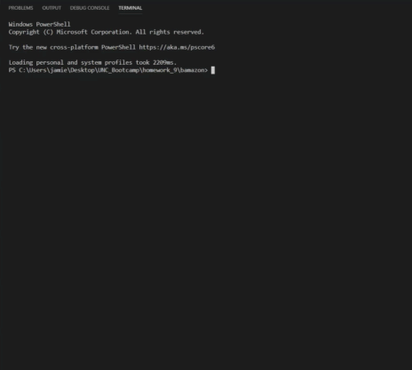
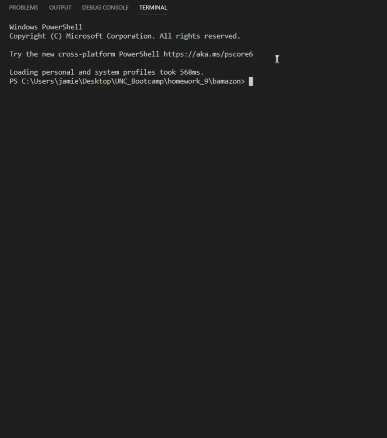

# bamazon

Application Overview: Bamazon is a command line node app that uses the inquirer npm to receive user responses and connects to mySQL database to store results.

Utility:  Bamazon has three different user interfaces: customer, manager, and supervisor.  
  1. The customer interface allows a user to view all items for sale and select an amount to purchase and will connect with the mySQL server to update the stock quantity of the purchased item.  
  2. The manager interface allows the user to either view a table of products for sale, view a table of all items with less than 20 units in stock, add to the stock quantity of a selected product, or enter a new item into the database.
  3. The supervisor interface allows the user to either view product sales by department or create a new department.   

Instructions:  
  1.  Customer Interface:
    - open command line prompt
    - type in "node bamazonCustomer.js" to initate the program
    - use the up and down arrow keys to scroll through the list of available items to purchase and press enter
    - type the desired quantity to purchase and press enter
    *** if the desired quantity exceeds the stock quantity, you will recieve an error 
    - click link for gif walk-through:
    
  
  2.  Manager Interface:
    - open command line prompt
    - type in "node bamazonManager.js" to initate the program
    - use the up and down arrow keys to scroll through the list of available options and press enter to select:
      A. View Products for Sale
        (this is a static view of all items for sell with the department name, price, and stock quantity)
      B. View Low Inventory
        (this is a static view of all items for sell with inventory of less than 20 units and displays the department name, price, and stock quantity)
      C. Add to Inventory
        1) use the up and down arrow keys to scroll through the list of available products and press enter to select
        2) type the number of units to add to the current stock quantity and press enter
      D. Add New Product
        1) type the name of the product to add and press enter
        2) type the name of the department for the new item and press enter
        3) type the price of the new item and press enter
        4) type the stock quantity of the new item and press enter
        *******if the department for the new item does not yet exist, you will receive an error to contact the Bamazon Supervisor

    - click link for gif walk-through:
    

  3.  Supervisor Interface:
    - open command line prompt
    - type in "node bamazonSupervisor.js" to initate the program
    - use the up and down arrow keys to scroll through the list of available options and press enter to select:
      A. View Product Sales by Department
        (this is a static view of all departments with overhead costs, product sales, and total profit)
      B. Create New Department
        1) type the name of the department to add and press enter
        2) type the overhead cost of the department and press enter 
    - click link for gif walk-through:
    

Technologies Deployed: 
  1. node.js (platform for executing JavaScript code server-side)
  2. npm - mysql (to store data in a database management system)
  3. npm - inquirer (to receive user inputs)
  4. npm - cli-table (to create a Table constructor to display data from mySQL)
  5. .env - this file allows mySQL password to be stored in a separate environment
  6. .gitignore - this file allows developer to choose which files not to upload to the repository (mySQL password as well as the cumbersome node_modules file)

Created by: Jamie O'Neill